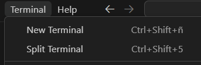

Información del grupo

Integrantes: Emilio Fernandez Ivan Almonacid Camila Cotapos

Correos: emifernandez@alumnos.uai.cl ialmonacid@alumnos.uai.cl ccotapos@alumnos.uai.cl

Linea de compilación: 

1. Abrir una terminal nueva.

2. Al abrir una terminal nueva, ejecutar make.

3. Luego cuando la terminal entregue el mensaje: "Compilación exitosa..." se puede empezar.

4. Para ejecutar poner en la terminal .\build\app1.exe junto con el archivo csv y la metrica a buscar.